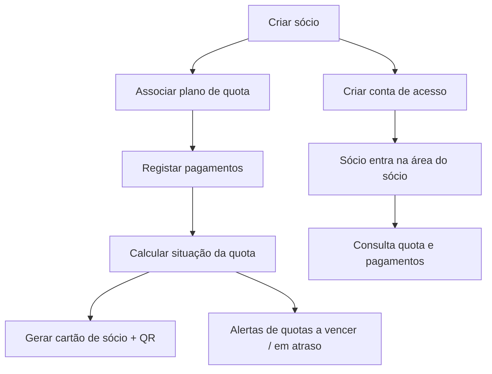

# MVP — Gestão de Sócios

## Objetivo do MVP
Permitir que um clube ou associação deixe de gerir sócios em folhas de cálculo e passe a ter:

- uma base única de sócios com situação de quota sempre atualizada;
- registo simples de pagamentos e alertas de quotas em atraso/a vencer;
- cartão de sócio digital com validação por QR;
- uma área online onde cada sócio consulta a sua quota e pagamentos.

O produto **não** tenta ser um ERP de associações. É um gestor focado em sócios + quotas + cartão, que depois pode evoluir.

> Estado atual: o núcleo do MVP **já está implementado**. Este plano serve para fechar as últimas validações e preparar a primeira utilização real.

## Stack
- **Laravel 13** — backend, API, autenticação (Sanctum), regras de negócio e base de dados.
- **Filament 5** — backoffice administrativo (`/admin`) para administradores e tesoureiros.
- **React (Vite)** — área do sócio (`frontend/`), focada em consulta rápida.
- **MySQL/MariaDB** em produção; **SQLite** em desenvolvimento.

## Módulos da Fase 1

1. **Sócios**
- Número, nome, email, telefone, data de adesão, foto, estado (ativo).
- Plano de quota associado e situação calculada.
- Conta de acesso à área do sócio (email/password).

2. **Planos de Quota**
- Periodicidade e valor.
- Tipo de vencimento (aniversário de adesão ou dia fixo do mês).

3. **Pagamentos**
- Data, valor, referência e notas por sócio.
- Base para calcular se a quota está em dia, a vencer ou em atraso.

4. **Cartão de Sócio**
- Template com branding do clube (cores, logótipo, campos).
- Exportação PDF/PNG e validação por QR (URL assinada, sem login).

5. **Área do Sócio**
- Login, troca obrigatória de password no 1.º acesso.
- Situação da quota e histórico de pagamentos.

## Fluxo Principal

## Modelo de Dados (implementado)
- `users` — utilizadores do backoffice e contas de sócio (com `permissao_id`, `member_id`, 2FA).
- `permissoes` — perfis (1 Imperador, 2 Administrador, 3 Tesoureiro).
- `members` — sócios.
- `quota_plans` — planos de quota.
- `payments` — pagamentos por sócio.
- `club_settings` — nome, logótipo, cores e campos do cartão.
- `app_settings` — definições de sistema (2FA obrigatório, dias de alerta).
- tabelas de lookup de periodicidade/tipo de vencimento e `activity_log` (auditoria).

## Divisão Laravel, Filament e React
**Laravel** concentra a regra de negócio:
- cálculo da situação da quota (em dia/a vencer/em atraso);
- autorização por perfil;
- emissão de cartão e validação por QR;
- API da área do sócio.

**Filament** é o backoffice:
- gestão de sócios, planos, pagamentos;
- utilizadores e perfis;
- definições do clube e do sistema;
- auditoria e relatórios.

**React** é a experiência do sócio:
- login e troca de password;
- consulta de quota e pagamentos;
- branding do clube.

## Issues em aberto (o que falta para fechar o MVP)

- **Validação ponta a ponta** numa instalação limpa: `php artisan migrate --seed`, login no `/admin`, criar sócio, registar pagamento, criar conta de acesso e entrar na área do sócio. (`validar-fluxo-ponta-a-ponta`)
- **Testes automatizados** mínimos: regras de quota, endpoints `/api/me/*`, permissões por perfil. (`testes-automatizados`)
- **Preparação de produção**: `.env` (MySQL, APP_URL, CORS), `config/route/view:cache`, `storage:link`, `gestao:create-imperador`, build do frontend. (`preparar-producao`)
- **Validação com clube real**: usar com 10–20 sócios reais e recolher feedback. (`validar-com-clube-real`)

## O Que Não Fazer Já
Deixar para depois da validação:

- Pagamentos online / gateway de pagamento.
- Emissão de recibos/faturação.
- Comunicações automáticas (email/SMS de aviso de quota).
- Multi-clube / multi-tenant avançado num único deploy.
- App mobile nativa.
- Relatórios analíticos avançados.

## Critério de Sucesso da Fase 1
O MVP está validado se um clube real conseguir, sem ajuda técnica:

- Registar e gerir os seus sócios e planos de quota.
- Registar pagamentos e ver quem está em atraso.
- Emitir o cartão de sócio com QR válido.
- Dar acesso aos sócios e estes conseguirem consultar a sua quota online.
- Responder positivamente: "isto poupa-me tempo e evita esquecer quotas?"
